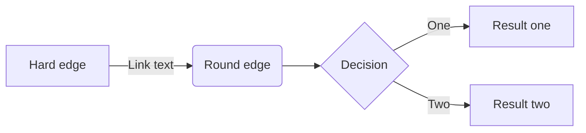

# Mermaid support

To enable mermaid, the mermaid for extention should be set.

**Example**

```yaml
---
mdext:
    - mermaid
---
```

There are two way to use mermaid
1. Use short code
1. Use markdown customized block

## Use shortcode


graph LR;
	A[Hard edge] -->|Link text| B(Round edge)
    B --> C{Decision}
    C -->|One| D[Result one]
    C -->|Two| E[Result two]



**Shortcode**

```markdown

graph LR;
	A[Hard edge] -->|Link text| B(Round edge)
    B --> C{Decision}
    C -->|One| D[Result one]
    C -->|Two| E[Result two]

```

## Markdown customized block(WIP)




```markdown

```

